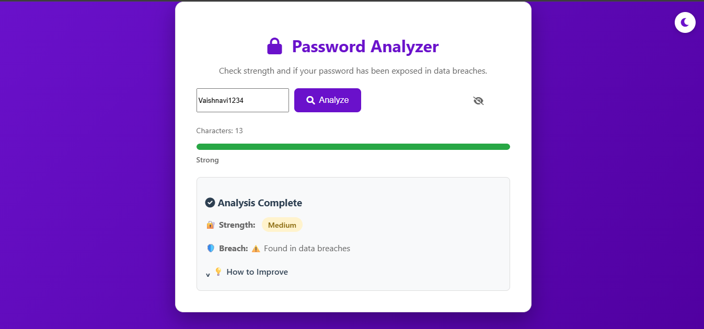

#  Password Strength & Breach Analyzer

A secure web application that checks the strength of passwords and informs users if their password has been exposed in known data breaches. Built with Python (Flask) for backend and a modern responsive frontend interface.

##  Features

- Real-time password strength assessment based on length, character types, and complexity.
- Simulated breach detection highlighting commonly exposed passwords.
- Privacy-focused design ensuring no actual password data is stored or fully sent externally.
- Interactive, user-friendly interface with live feedback and progress visualization.
- Modular backend logic with Flask and a clean frontend built using HTML, CSS, and JavaScript.

##  Installation

To run this project locally, follow the steps:

1. Clone the repository:  
   git clone https://github.com/yourusername/password-analyzer.git
2. Change to the project directory:  
   cd password_analyzer
3. Install the required Python packages:  
   pip install -r requirements.txt
4. Run the Flask application:  
   `python app.py
5. Open your browser and go to:  
   http://127.0.0.1:8000

##  How to Use

- Enter a password into the input box.
- Click the "Analyze" button.
- See immediate feedback on password strength and breach status.
- Use the improvement tips to create a more secure password.

##  Screenshots

  
 

##  Demo Video

[▶️ Watch Demo Video](https://drive.google.com/drive/folders/1f-mbkEOLO1S1w8Bd9UjlHokACWhSzuS6)

##  Security and Privacy

This project does NOT store or send your full passwords. It uses SHA-1 hashing and only sends the first 5 characters of the hash to check breaches, with a simulated fallback for privacy and demonstration purposes.

Thank you for checking out this project! 

